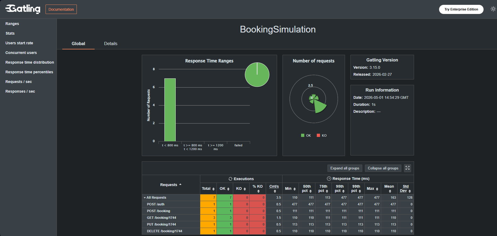

# Gatling API functional and performance tests

Goal of this project is to practice:
- building reusable and scalable Gatling framework from scratch
- creating realistic API scenarios
- various configurations of performance testing

### API under test

<b><a href=https://restful-booker.herokuapp.com/apidoc/>restful-booker</b></a>

## 🚀 Tech stack


- Datafaker
- Lombok

## 📦 Project structure

```
├───src
│   ├───main
│   │   └───java
│   └───test
│       ├───java
│       │   ├───api
│       │   ├───scenarios
│       │   ├───simulations
│       │   │   └───functional
│       │   └───utils
│       └───resources
│           └───bodies
```

## 🧪 Scenarios
[BookingScenario](src/test/java/scenarios/BookingScenario.java)
### BookingE2EScenario

Full booking lifecycle:
create → get → update → get → delete

## ⚙️ Running tests
### Functional tests

- Single user
- Validate API responses and status codes
- Example: [BookingSimulation](src/test/java/simulations/functional/BookingSimulation.java)

### Performance tests
- TBD

### Configuration
- Base URL is defined in [config.properties](src/test/resources/config.properties)
- Example command:
```
mvn gatling:test '-Dgatling.simulationClass=simulations.functional.BookingSimulation'
```

### Reports
After test execution, Gatling generates reports in
`target/gatling/`
<br>
Open `index.html` to see execution details, including:
- number of requests
- response times
- errors



## 📝 TODO list
- [ ] Add GET only scenario
- [ ] Add POST only scenario
- [ ] Add performance simulations